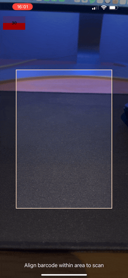

# vision-camera-barcode-scanner

- **NEW: With Inverted Scanning Feature - Scan inverted barcodes and QR codes**

<!-- markdownlint-disable MD033 -->
<p align="center">
  <a href="https://mgcrea.github.io/vision-camera-barcode-scanner">
    
  </a>
</p>
<p align="center">
  <a href="https://www.npmjs.com/package/@mgcrea/vision-camera-barcode-scanner">
    
  </a>
  <a href="https://www.npmjs.com/package/@mgcrea/vision-camera-barcode-scanner">
    
  </a>
  <a href="https://www.npmjs.com/package/@mgcrea/vision-camera-barcode-scanner">
    
  </a>
  <a href="https://www.npmjs.com/package/@mgcrea/vision-camera-barcode-scanner">
    
  </a>
  <br />
  <a href="https://github.com/mgcrea/vision-camera-barcode-scanner/actions/workflows/main.yml">
    
  </a>
  <a href="https://depfu.com/github/mgcrea/vision-camera-barcode-scanner">
    
  </a>
</p>
<!-- markdownlint-enable MD037 -->

## Features

High performance barcode scanner for React Native using VisionCamera.

- **Modern and future-proof:** Built on [react-native-vision-camera](https://github.com/mrousavy/react-native-vision-camera) with minimal native dependencies for each platforms to minimize future build-failure risk.

- **Minimal footprint:** Leverages [Google's MLKit BarcodeScanner](https://developers.google.com/android/reference/com/google/mlkit/vision/barcode/package-summary) on Android and [Apple's Vision VNDetectBarcodesRequest](https://developer.apple.com/documentation/vision/vndetectbarcodesrequest).

- **Powerful & Performant:** The implementation has been tailored for advanced use cases where performance is critical. Scanning barcodes is butter smooth at 30fps, and you can customize the detection speed loop (detection fps).

- **Hooks based:** Exposes easy-to-use hooks [`useBarcodeScanner`](./src/hooks/useBarcodeScanner.ts) to quickly get started

<!-- Check the [**Documentation**](https://mgcrea.github.io/vision-camera-barcode-scanner/) for usage details. -->

## Demo



A working project can be found at [vision-camera-barcode-scanner-example](./example)

## Install

> [!WARNING]
> The project is currently trying to closely track the [react-native-vision-camera v4](https://github.com/mrousavy/react-native-vision-camera/releases),
> The latest 0.11+ releases are made to work with the latest react-native-vision-camera release only (currently 4.0.0)

```bash
npm i @kaizer433/vision-camera-barcode-scanner
# or
yarn add @kaizer433/vision-camera-barcode-scanner
```

### Dependencies

This package relies on:

- [react-native-vision-camera@>=3](https://github.com/mrousavy/react-native-vision-camera)
- [react-native-worklets-core](https://github.com/margelo/react-native-worklets-core)

You must add them as dependencies to your project:

```bash
npm install react-native-vision-camera react-native-worklets-core
# or
yarn add react-native-vision-camera react-native-worklets-core
# or
pnpm add react-native-vision-camera react-native-worklets-core
```

Then you must follow their respective installation instructions:

- [react-native-worklets-core](https://github.com/margelo/react-native-worklets-core#installation)

## Quickstart

```tsx
import {
  CameraHighlights,
  useBarcodeScanner,
} from "@kaizer433/vision-camera-barcode-scanner";
import type { FunctionComponent } from "react";
import { StyleSheet } from "react-native";

export const App: FunctionComponent = () => {
  // @NOTE you must properly ask for camera permissions first!
  // You should use `PermissionsAndroid` for Android and `Camera.requestCameraPermission()` on iOS.

  const { props: cameraProps, highlights } = useBarcodeScanner({
    fps: 5,
    barcodeTypes: ["qr", "ean-13"], // optional
    checkInverted:true,//if you want to scan inverted
    onBarcodeScanned: (barcodes) => {
      "worklet";
      console.log(
        `Scanned ${barcodes.length} codes with values=${JSON.stringify(
          barcodes.map(({ value }) => value),
        )} !`,
      );
    },
  });

  const devices = useCameraDevices();
  const device = devices.find(({ position }) => position === "back");
  const format = useCameraFormat(device, [
    { videoResolution: { width: 1920, height: 1080 } },
  ]);
  if (!device) {
    return null;
  }

  return (
    <View style={{ flex: 1 }}>
      <Camera
        style={StyleSheet.absoluteFill}
        device={device}
        isActive
        {...cameraProps}
      />
      <CameraHighlights highlights={highlights} color="peachpuff" />
    </View>
  );
};
```

